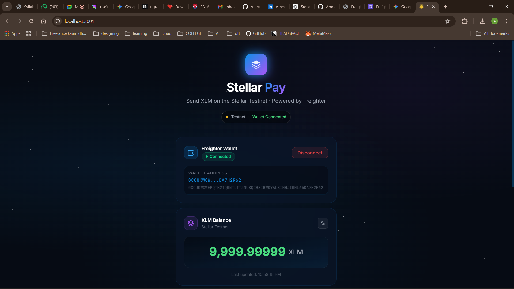
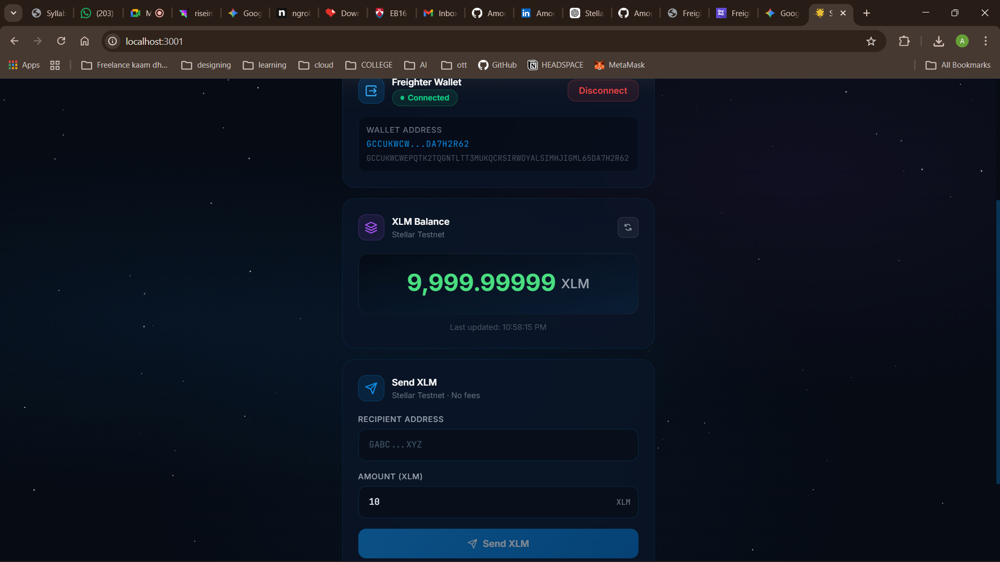
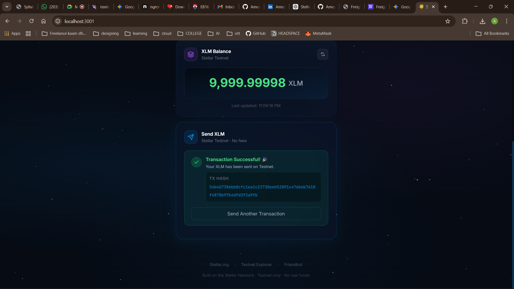

# 🌟 Stellar Pay

A minimal, production-ready Stellar dApp on Testnet that lets you connect your Freighter wallet, view your XLM balance, and send XLM — all in a sleek dark-mode UI.

---

## 📸 Screenshots

### Wallet Connected + Balance


### Balance Display + Send Form


### Successful Transaction + TX Hash


---

## ⚡ Features

- ✅ **Wallet Integration** — Connect/disconnect via Freighter (v6 API)
- ✅ **Balance Display** — Real-time XLM balance from Horizon Testnet
- ✅ **Send XLM** — Build, sign, and submit payment transactions
- ✅ **Transaction Feedback** — Loading → success/error states with clickable TX hash
- ✅ **Error Handling** — Wallet not installed, invalid address, insufficient balance, network errors

---

## 🛠 Tech Stack

| Layer      | Technology                         |
|------------|------------------------------------|
| Frontend   | Next.js 14 (App Router)            |
| Styling    | Tailwind CSS + Custom CSS          |
| Blockchain | @stellar/stellar-sdk v15           |
| Wallet     | @stellar/freighter-api v6          |
| Network    | Stellar Testnet (Horizon)          |
| Deploy     | Vercel                             |

---

## 🚀 Getting Started

### Prerequisites

1. Install [Freighter Wallet](https://www.freighter.app) browser extension
2. Switch Freighter to **Testnet** network in its settings
3. Fund your testnet wallet at [Friendbot](https://friendbot.stellar.org)

### Run Locally

```bash
npm install
npm run dev
```

Open [http://localhost:3000](http://localhost:3000)

### Deploy to Vercel

```bash
vercel --prod
```

---

## 📁 File Structure

```
/app
  layout.tsx          # Root layout + SEO metadata
  page.tsx            # Main single-page app
  globals.css         # Design system + animations

/components
  WalletConnect.tsx   # Freighter connect/disconnect
  BalanceCard.tsx     # XLM balance display
  SendForm.tsx        # Payment form + status

/lib
  stellar.ts          # Stellar SDK utilities

/public/screenshots   # App screenshots for README
```

---

## 🧪 Test Checklist

- [x] Freighter wallet connects
- [x] XLM balance loads from Horizon
- [x] Payment transaction succeeds
- [x] TX hash shown with Stellar Expert link
- [x] Error states shown in UI
- [x] Works on Stellar Testnet

---

## 🔐 Environment

No backend required. Uses the public Stellar Testnet Horizon endpoint:
```
https://horizon-testnet.stellar.org
```

---

Built for the **Stellar White Belt** submission 🚀
